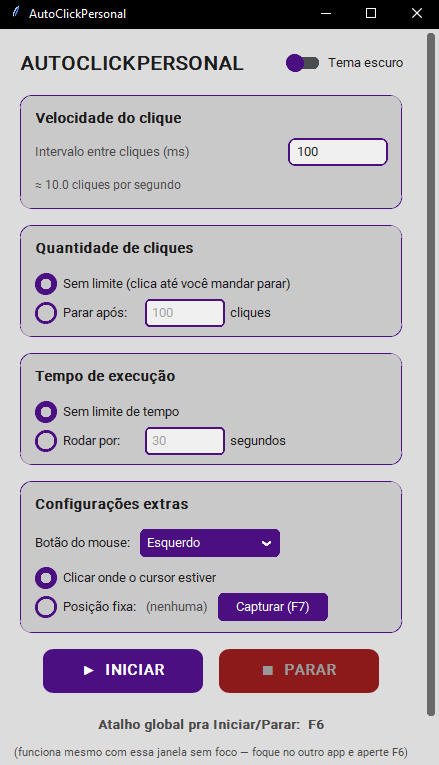

readme = """# AutoClickPersonal

Modo escuro


Modo claro



## Instalar

```bash
pip install -r requirements.txt


atalhos:
f6 -> inicia e para o autoclick.
f7 -> capitura a posição fixa do pinteiro do mouse.

caminho do .exe
AutoClickPersonal/dist/AutoClickPersonal.exe